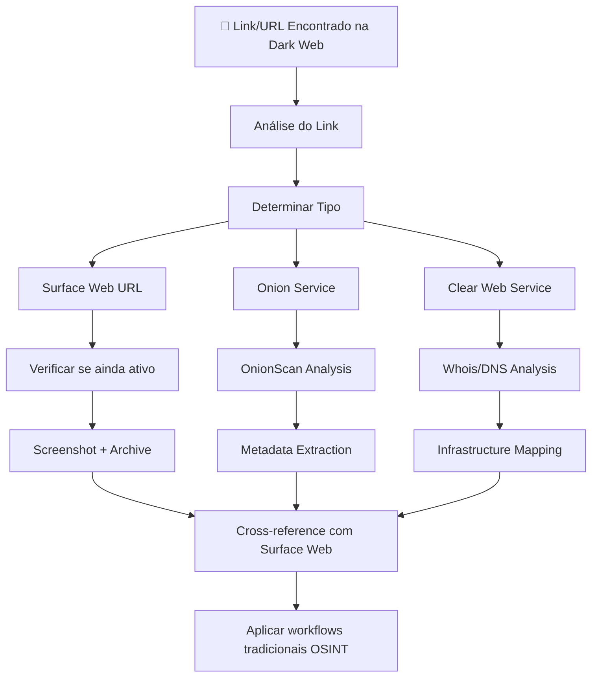
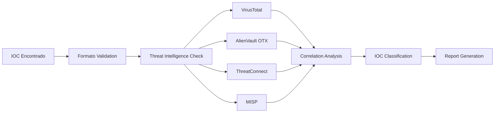

# OSINT: A Partir de Evidências da Dark Web

## Visão Geral

Este workflow detalha como conduzir investigações OSINT usando evidências ou pistas descobertas na Dark Web como ponto de partida. Aplica-se quando informações são encontradas em fóruns onion, pastebins, chats anônimos ou outros serviços .onion que apontam para atividades na surface web ou necessitam de validação cruzada.

## 🛡️ Preparação OPSEC

### Ambiente Isolado
- **Obrigatório**: VM Tails ou Whonix
- **VPN**: Multi-hop antes do Tor
- **Navegador**: Tor Browser com JavaScript desabilitado
- **Documentação**: Sistema de notas offline e criptografado

### Sock Puppet Setup
- Personas fictícias específicas para cada investigação
- Contas de email criadas via Tor
- VMs separadas para diferentes identidades
- Never cross-contaminate identities

## 📋 Tipos de Evidências Dark Web

### 1. 🔗 Links e URLs Descobertos

**Fontes Comuns:**
- Pastebins onion (.onion/paste/xxx)
- Posts em fóruns underground
- Chats anônimos
- Imageboards

**Processo de Investigação:**



### 2. 👤 Usernames/Handles

**Processo:**
```
Descoberta no Dark Web → Username Search → Cross-Platform Analysis → Profile Correlation
```

**Ferramentas Específicas:**
- Sherlock
- WhatsMyName
- Knowem
- Cross-reference com Surface Web

### 3. 📧 Endereços de Email

**Fluxo de Validação:**
```
Email na Dark Web → Have I Been Pwned → Hunter.io → Social Media Search → Domain Analysis
```

### 4. 💬 Comunicações e Conversas

**Tipos de Análise:**
- Análise linguística para determinação de região/idioma
- Timestamps para correlação temporal
- Tópicos discutidos para context mapping
- Usernames mencionados para network analysis

### 5. 📱 Números de Telefone

**Processo de Verificação:**
```
Número encontrado → Validação regional → Carrier lookup → Social media search → People search engines
```

### 6. 🏠 Endereços Físicos

**Metodologia:**
- Google Street View analysis
- Property records search
- Business registration lookup
- Social media geotag correlation

## 🔍 Workflows por Tipo de Evidência

### A. Username → Surface Web Investigation

| Passo | Ação | Ferramentas | Nível de Confiança |
|-------|------|-------------|-------------------|
| 1 | Busca em motores convencionais | Google, Bing, DuckDuckGo | 🟡 Medium |
| 2 | Verificação em redes sociais | Manual + OSINT-SPY | 🟢 High |
| 3 | Username search engines | Sherlock, Knowem | 🟢 High |
| 4 | Archive.org search | Wayback Machine | 🟡 Medium |
| 5 | Cross-platform correlation | Manual analysis | 🟢 High |

### B. Email → Identity Verification

| Passo | Ação | Ferramentas | Nível de Confiança |
|-------|------|-------------|-------------------|
| 1 | Breach database check | HIBP, Hacked-Emails | 🟢 High |
| 2 | Email validation | Hunter.io, VerifyEmail | 🟢 High |
| 3 | Social media lookup | Facebook, LinkedIn search | 🟡 Medium |
| 4 | Domain analysis | Whois, DNS records | 🟢 High |
| 5 | Gravatar/profile pics | Gravatar.com | 🟡 Medium |

### C. URL → Infrastructure Analysis

| Passo | Ação | Ferramentas | Nível de Confiança |
|-------|------|-------------|-------------------|
| 1 | Website accessibility | Browser check | 🟢 High |
| 2 | Archive capture | Archive.today, Wayback | 🟢 High |
| 3 | Whois lookup | whois.net, domaintools | 🟢 High |
| 4 | DNS analysis | DNSdumpster, ViewDNS | 🟢 High |
| 5 | Technology stack | Wappalyzer, BuiltWith | 🟡 Medium |

### D. Phone Number → Person Identification

| Passo | Ação | Ferramentas | Nível de Confiança |
|-------|------|-------------|-------------------|
| 1 | Carrier identification | Twilio Lookup, OpenCNAM | 🟢 High |
| 2 | Region/country check | PhoneValidator.net | 🟢 High |
| 3 | Reverse phone lookup | TrueCaller, WhitePages | 🟡 Medium |
| 4 | Social media search | Facebook phone search | 🟡 Medium |
| 5 | People search engines | Pipl, ThatsThem | 🔴 Low |

## 🚨 Indicators de Ameaça (IOCs)

### Extração de IOCs da Dark Web

**Tipos de IOCs Comuns:**
- Bitcoin addresses
- Tor hidden service addresses
- Email addresses
- Domain names
- IP addresses
- File hashes (MD5, SHA1, SHA256)
- URLs maliciosos

**Processo de Validação:**



## 📊 Template de Documentação

### Estrutura do Relatório

```markdown
# Investigação Dark Web → Surface Web
**Case ID**: DW-YYYY-MM-DD-XXX
**Investigator**: [Sock Puppet ID]
**Date Range**: [Start] - [End]
**Classification**: [Confidential/Internal/Public]

## 1. Fonte da Evidência
- **Platform**: [Forum/Chat/Pastebin/etc]
- **URL Onion**: [Endereço .onion]
- **Timestamp**: [Data/hora da descoberta]
- **Context**: [Como foi encontrado]

## 2. Evidência Coletada
- **Type**: [Username/Email/URL/Phone/etc]
- **Value**: [Valor censurado se necessário]
- **Screenshot**: [Path/reference]
- **Hash**: [MD5/SHA256 do arquivo]

## 3. Análise Cross-Platform
### Surface Web Presence
- **Google Results**: [X results found]
- **Social Media**: [Platforms confirmed]
- **Additional Data**: [Phone, email, etc]

### Correlations Found
- **Confidence Level**: [🔴 Low / 🟡 Medium / 🟢 High]
- **Evidence Chain**: [Como as evidências se conectam]

## 4. IOCs Extracted
| Type | Value | Validated | Threat Level | Source |
|------|-------|-----------|--------------|--------|
| Domain | example.com | ✅ | Medium | Pastebin |
| Email | user@domain.com | ✅ | High | Forum post |

## 5. Recommendations
- [Ações sugeridas]
- [Follow-up investigations]
- [Threat mitigation]

## 6. Appendices
- Screenshots (censored)
- Technical logs
- IOC list (machine readable)
```

## 🔗 Cross-Reference com Surface Web

### Metodologia de Correlação

1. **Temporal Correlation**
   - Compare timestamps entre atividades dark web e surface web
   - Analise padrões de posting/atividade
   - Timeline de eventos

2. **Linguistic Analysis**
   - Análise de estilo de escrita
   - Gírias/expressões específicas
   - Idioma predominante

3. **Technical Indicators**
   - IP addresses (com cuidado)
   - User-Agent strings
   - Timezone preferences

4. **Content Analysis**
   - Tópicos de interesse
   - Expertise demonstrada
   - References/citations

## ⚖️ Considerações Legais e Éticas

### Limites da Investigação

**✅ Permitido:**
- Análise de informações públicas
- Cross-reference com dados públicos
- Documentação de IOCs para defesa
- Threat intelligence sharing

**❌ Proibido:**
- Participação ativa em atividades ilícitas
- Download de material ilegal
- Tentativas de acesso não autorizado
- Exposição de identidades sem autorização legal

### Chain of Custody

- Todos os screenshots devem ter timestamp
- Hashes criptográficos de evidências
- Log detalhado de ferramentas utilizadas
- Documentação de métodos de coleta

## 🛠️ Ferramentas Recomendadas

### Dark Web Analysis
- **OnionScan**: Análise técnica de hidden services
- **TorBot**: Crawling automatizado
- **VigilantOnion**: Monitoramento de links
- **Ahmia**: Search engine para .onion

### Cross-Platform Correlation
- **Sherlock**: Username search across platforms
- **Maltego**: Visual correlation analysis
- **SpiderFoot**: Automated OSINT gathering
- **TheHarvester**: Email/domain enumeration

### Threat Intelligence
- **MISP**: IOC management and sharing
- **OpenCTI**: Cyber threat intelligence platform
- **VirusTotal**: Malware/URL analysis
- **AlienVault OTX**: Community threat intelligence

## 📈 Métricas e KPIs

### Eficácia da Investigação
- **Time to First Lead**: Tempo até primeira correlação válida
- **Cross-Platform Matches**: % de matches encontrados na surface web
- **IOC Validation Rate**: % de IOCs confirmados como maliciosos
- **False Positive Rate**: % de correlações incorretas

### Quality Assurance
- **Source Reliability**: Confiabilidade das fontes dark web
- **Evidence Chain Strength**: Força da cadeia de evidências
- **Legal Compliance**: Aderência aos procedimentos legais

---

**🔒 Classificação**: Internal Use Only
**📅 Última Atualização**: 2025-09-27
**👥 Aprovado por**: Security Team Lead
**📋 Versão**: 1.0