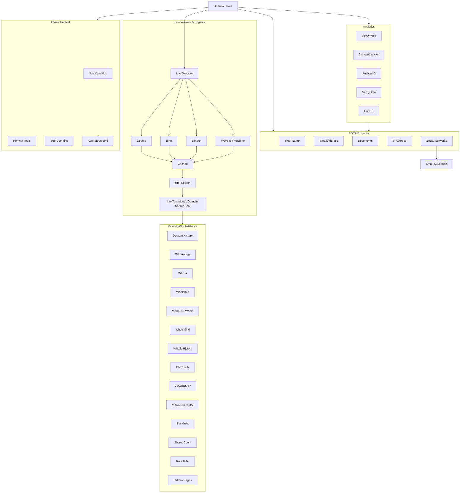

# OSINT Workflow Chart: Domain Name

```mermaid
flowchart TB
    A[Domain Name]

    %% Seção 1 - Live Website
    subgraph S1 [Live Website & Engines]
      B[Live Website]
      I[Google]
      J[Bing]
      K[Yandex]
      L[Wayback Machine]
      M[Cached]
      N[site: Search]
      O[IntelTechniques Domain Search Tool]
    end

    %% Seção 2 - Analytics
    subgraph S2 [Analytics]
      C1[SpyOnWeb]
      C2[DomainCrawler]
      C3[AnalyzeID]
      C4[NerdyData]
      C5[PubDB]
    end

    %% Seção 3 - Domain Info
    subgraph S3 [Domain/Whois/History]
      U[Domain History]
      V[Whoisology]
      W[Who.is]
      X[WhoisInfo]
      Y[ViewDNS Whois]
      Z[WhoisMind]
      AA[Who.is History]
      AB[DNSTrails]
      AC[ViewDNS-IP]
      AD[ViewDNSHistory]
      AE[Backlinks]
      AF[SharedCount]
      AG[Robots.txt]
      AH[Hidden Pages]
    end

    %% Seção 4 - FOCA
    subgraph S4 [FOCA Extraction]
      P[Real Name]
      Q[Email Address]
      R[Documents]
      S[IP Address]
      T[Social Networks]
    end

    %% Seção 5 - Subdomains/Pentest
    subgraph S5 [Infra & Pentest]
      D[New Domains]
      E[Pentest Tools]
      F[Sub Domains]
      H[App: Metagoofil]
    end

    %% Ligações principais
    A --> B
    A --> S2
    A --> S4
    A --> S5

    B --> I --> M --> N --> O
    B --> J --> M
    B --> K --> M
    B --> L --> M
    O --> S3

    S2 --> S4
    S5 --> H
    T --> AI[Small SEO Tools]
```