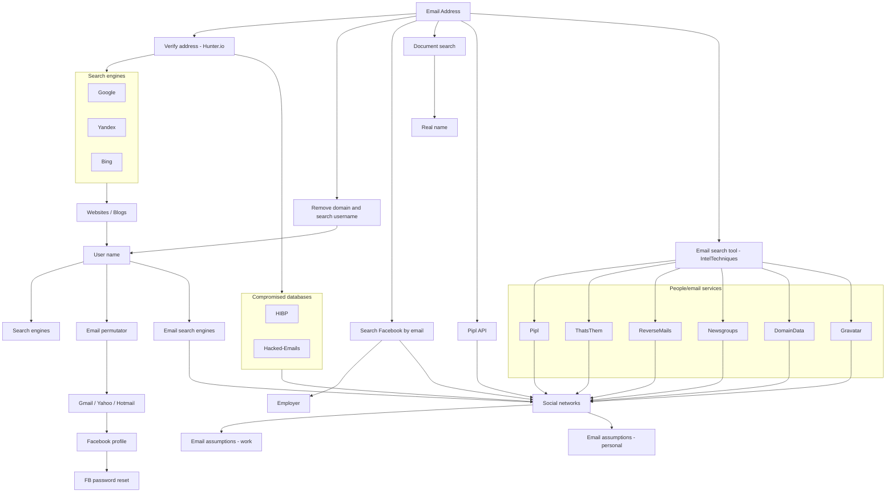

# OSINT Workflow Chart: Email Address

```mermaid
flowchart TB
    A["Email Address"]

    %% Passos iniciais
    A --> B["Verify address - Hunter.io"]
    A --> C["Remove domain and search username"]
    A --> D["Search Facebook by email"]
    A --> E["Document search"]
    A --> F["Pipl API"]
    A --> G["Email search tool - IntelTechniques"]

    %% Search engines
    subgraph S1 ["Search engines"]
      H1["Google"]
      H2["Yandex"]
      H3["Bing"]
    end
    B --> S1
    S1 --> H4["Websites / Blogs"]

    %% Compromised databases
    subgraph S2 ["Compromised databases"]
      I1["HIBP"]
      I2["Hacked-Emails"]
    end
    B --> S2

    %% Username extraction
    C --> J["User name"]
    H4 --> J

    %% Resultados de buscas
    D --> K["Employer"]
    E --> L["Real name"]

    %% Pipl e correlatos
    F --> R["Social networks"]
    subgraph S3 ["People/email services"]
      N1["Pipl"]
      N2["ThatsThem"]
      N3["ReverseMails"]
      N4["Newsgroups"]
      N5["DomainData"]
      N6["Gravatar"]
    end
    G --> N1
    G --> N2
    G --> N3
    G --> N4
    G --> N5
    G --> N6
    N1 --> R
    N2 --> R
    N3 --> R
    N4 --> R
    N5 --> R
    N6 --> R
    S2 --> R
    D --> R

    %% Expansao por username
    J --> O["Search engines"]
    J --> P["Email permutator"]
    J --> Q["Email search engines"]
    Q --> R

    %% Assumptions
    R --> S["Email assumptions - work"]
    R --> T["Email assumptions - personal"]

    %% Provedores e FB reset
    P --> U["Gmail / Yahoo / Hotmail"]
    U --> V["Facebook profile"]
    V --> W["FB password reset"]
```