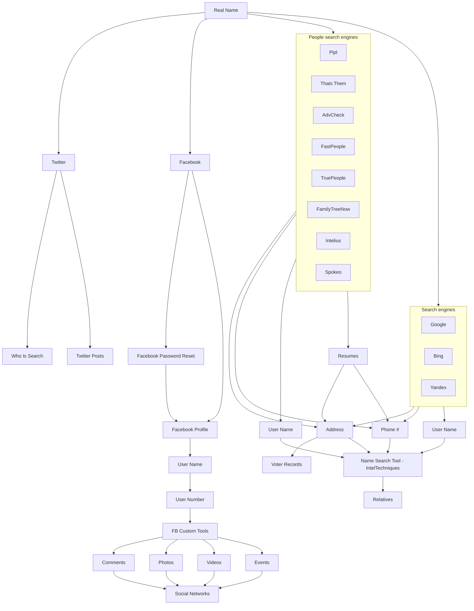

# OSINT Workflow Chart: Real Name (compact)

```mermaid
flowchart TB
    A["Real Name"]

    %% Redes sociais diretas
    A --> TW["Twitter"]
    TW --> T1["Who Is Search"]
    TW --> T2["Twitter Posts"]

    A --> FB["Facebook"]
    FB --> FBR["Facebook Password Reset"]
    FB --> FBP["Facebook Profile"]
    FBR --> FBP
    FBP --> UN["User Name"]
    UN --> UNUM["User Number"]
    UNUM --> FBT["FB Custom Tools"]
    FBT --> CMT["Comments"]
    FBT --> PHO["Photos"]
    FBT --> VID["Videos"]
    FBT --> EVT["Events"]
    CMT --> SNS["Social Networks"]
    PHO --> SNS
    VID --> SNS
    EVT --> SNS

    %% People search engines
    subgraph PSE ["People search engines"]
      PIPL["Pipl"]
      TT["Thats Them"]
      AC["AdvCheck"]
      FP["FastPeople"]
      TP["TruePeople"]
      FTN["FamilyTreeNow"]
      INT["Intelius"]
      SPOK["Spokeo"]
    end
    A --> PSE

    %% Saídas de people search
    PSE --> ADR["Address"]
    PSE --> PHN["Phone #"]
    PSE --> UN2["User Name"]
    RES["Resumes"]
    PSE --> RES
    RES --> ADR
    RES --> PHN

    %% Search engines
    subgraph SE ["Search engines"]
      G["Google"]
      B["Bing"]
      Y["Yandex"]
    end
    A --> SE
    SE --> ADR
    SE --> PHN
    SE --> UN3["User Name"]

    %% Registros e agregador
    ADR --> VR["Voter Records"]

    %% IntelTechniques aggregator
    ADR --> IT["Name Search Tool - IntelTechniques"]
    PHN --> IT
    UN2 --> IT
    UN3 --> IT
    IT --> REL["Relatives"]
```