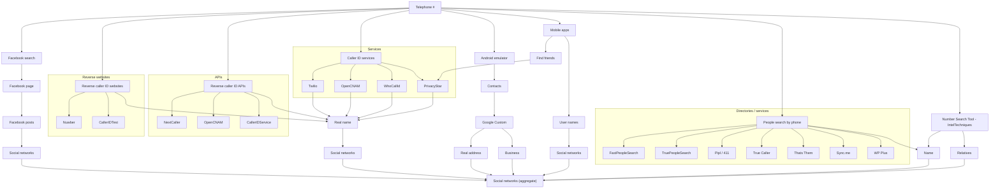

# OSINT Workflow Chart: Telephone (compact, vertical)

```mermaid
flowchart TB
    A["Telephone #"]

    %% 1) Facebook
    A --> FB["Facebook search"]
    FB --> FBP["Facebook page"]
    FBP --> FPOST["Facebook posts"]
    FPOST --> SNS1["Social networks"]

    %% 2) Reverse caller ID - websites
    A --> RCW0["Reverse caller ID websites"]
    subgraph RCW ["Reverse websites"]
      RCW0 --> Nuw["Nuwber"]
      RCW0 --> CIDT["CallerIDTest"]
    end

    %% 3) Reverse caller ID - APIs
    A --> RCAPI0["Reverse caller ID APIs"]
    subgraph RCAPI ["APIs"]
      RCAPI0 --> Next["NextCaller"]
      RCAPI0 --> OpenC["OpenCNAM"]
      RCAPI0 --> CIDServ["CallerIDService"]
    end

    %% 4) Caller ID services
    A --> SRV0["Caller ID services"]
    subgraph SRV ["Services"]
      SRV0 --> Twilio["Twilio"]
      SRV0 --> OpenC2["OpenCNAM"]
      SRV0 --> WhoCall["WhoCallId"]
      SRV0 --> PrivStar["PrivacyStar"]
    end

    %% Real name / social
    RCW0 --> RN["Real name"]
    RCAPI0 --> RN
    Twilio --> RN
    OpenC2 --> RN
    WhoCall --> RN
    PrivStar --> RN
    RN --> SNS2["Social networks"]

    %% 5) Emulator / contacts / google
    A --> AE["Android emulator"]
    AE --> CT["Contacts"]
    CT --> Gc["Google Custom"]
    Gc --> RADDR["Real address"]
    Gc --> BUS["Business"]

    %% 6) Mobile apps
    A --> MOB["Mobile apps"]
    MOB --> FF["Find friends"]
    FF --> PrivStar
    MOB --> UN["User names"]
    UN --> SNS3["Social networks"]

    %% 7) People search by phone
    A --> PPL0["People search by phone"]
    subgraph PPL ["Directories / services"]
      PPL0 --> FPS["FastPeopleSearch"]
      PPL0 --> TPS["TruePeopleSearch"]
      PPL0 --> Pipl411["Pipl / 411"]
      PPL0 --> TrueCaller["True Caller"]
      PPL0 --> TT["Thats Them"]
      PPL0 --> SyncMe["Sync.me"]
      PPL0 --> WPPlus["WP Plus"]
    end
    PPL0 --> NAME["Name"]

    %% Aggregator
    A --> IT["Number Search Tool - IntelTechniques"]
    IT --> NAME
    IT --> REL["Relatives"]

    %% Saída agregada (estreita)
    SNS1 --> OUT["Social networks (aggregate)"]
    SNS2 --> OUT
    SNS3 --> OUT
    NAME --> OUT
    RADDR --> OUT
    BUS --> OUT
    REL --> OUT
```