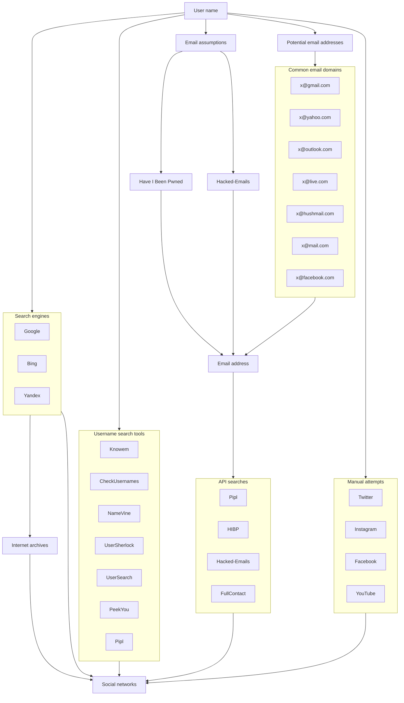

# OSINT Workflow Chart: Username (compact)

```mermaid
flowchart TB
    A["User name"]

    %% 1) Search engines
    subgraph SE ["Search engines"]
      G["Google"]
      B["Bing"]
      Y["Yandex"]
    end
    A --> SE

    %% 2) Username search tools
    subgraph UST ["Username search tools"]
      K["Knowem"]
      CU["CheckUsernames"]
      NV["NameVine"]
      USH["UserSherlock"]
      USE["UserSearch"]
      PY["PeekYou"]
      PIPL["Pipl"]
    end
    A --> UST

    %% 3) Potenciais e-mails e suposições
    A --> PEA["Potential email addresses"]
    subgraph DOMS ["Common email domains"]
      D1["x@gmail.com"]
      D2["x@yahoo.com"]
      D3["x@outlook.com"]
      D4["x@live.com"]
      D5["x@hushmail.com"]
      D6["x@mail.com"]
      D7["x@facebook.com"]
    end
    PEA --> DOMS
    DOMS --> EADDR["Email address"]

    A --> ASSU["Email assumptions"]
    ASSU --> HIBP["Have I Been Pwned"]
    ASSU --> HE["Hacked-Emails"]
    HIBP --> EADDR
    HE --> EADDR

    %% 4) APIs e correlação por e-mail
    subgraph API ["API searches"]
      AP1["Pipl"]
      AP2["HIBP"]
      AP3["Hacked-Emails"]
      AP4["FullContact"]
    end
    EADDR --> API

    %% 5) Tentativas manuais em redes
    subgraph MAN ["Manual attempts"]
      TW["Twitter"]
      IG["Instagram"]
      FB["Facebook"]
      YT["YouTube"]
    end
    A --> MAN

    %% 6) Internet archives
    IA["Internet archives"]
    SE --> IA

    %% 7) Saída agregada
    SN["Social networks"]
    SE --> SN
    UST --> SN
    API --> SN
    MAN --> SN
    IA --> SN
```