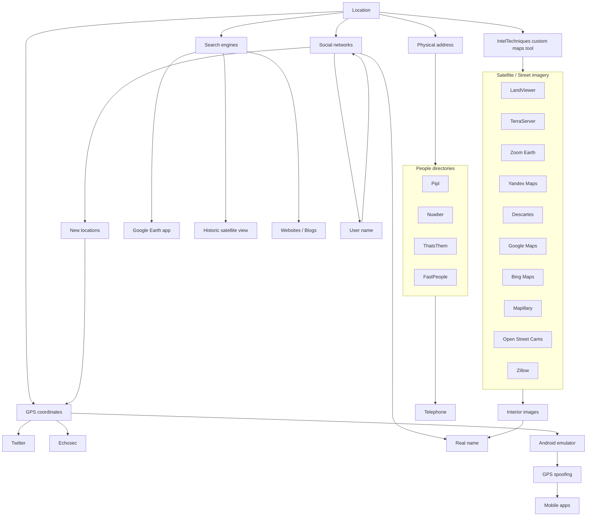

# OSINT Workflow Chart: Location (compact)

```mermaid
flowchart TB
    A["Location"]

    %% Entradas principais
    A --> B["GPS coordinates"]
    A --> C["IntelTechniques custom maps tool"]
    A --> D["Physical address"]
    A --> E["Search engines"]
    A --> F["Social networks"]

    %% GPS -> social sources
    B --> B1["Twitter"]
    B --> B2["Echosec"]

    %% Search engines e visão histórica
    E --> G["Google Earth app"]
    E --> H["Historic satellite view"]
    E --> I["Websites / Blogs"]

    %% Imagery e mapas
    subgraph S2 ["Satellite / Street imagery"]
      S2a["LandViewer"]
      S2b["TerraServer"]
      S2c["Zoom Earth"]
      S2d["Yandex Maps"]
      S2e["Descartes"]
      S2f["Google Maps"]
      S2g["Bing Maps"]
      S2h["Mapillary"]
      S2i["Open Street Cams"]
      S2j["Zillow"]
    end
    C --> S2
    S2 --> J["Interior images"]

    %% Pessoas / diretórios
    subgraph S3 ["People directories"]
      P1["Pipl"]
      P2["Nuwber"]
      P3["ThatsThem"]
      P4["FastPeople"]
    end
    D --> S3
    S3 --> T["Telephone"]

    %% Resultados centrais
    F --> K["User name"]
    F --> L["Real name"]
    J --> L

    %% Loop de descoberta
    K --> F
    F --> M["New locations"]
    M --> B
    B --> N["Android emulator"]
    N --> O["GPS spoofing"]
    O --> P["Mobile apps"]
```