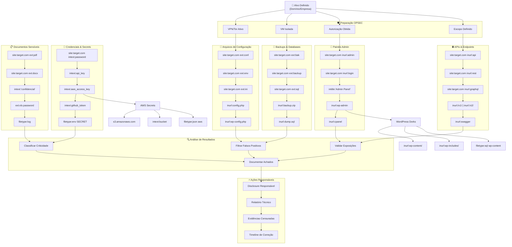
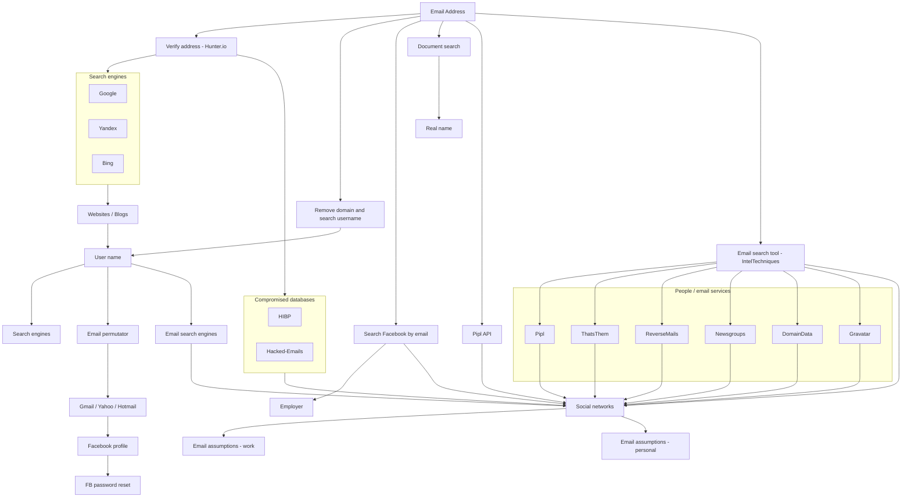
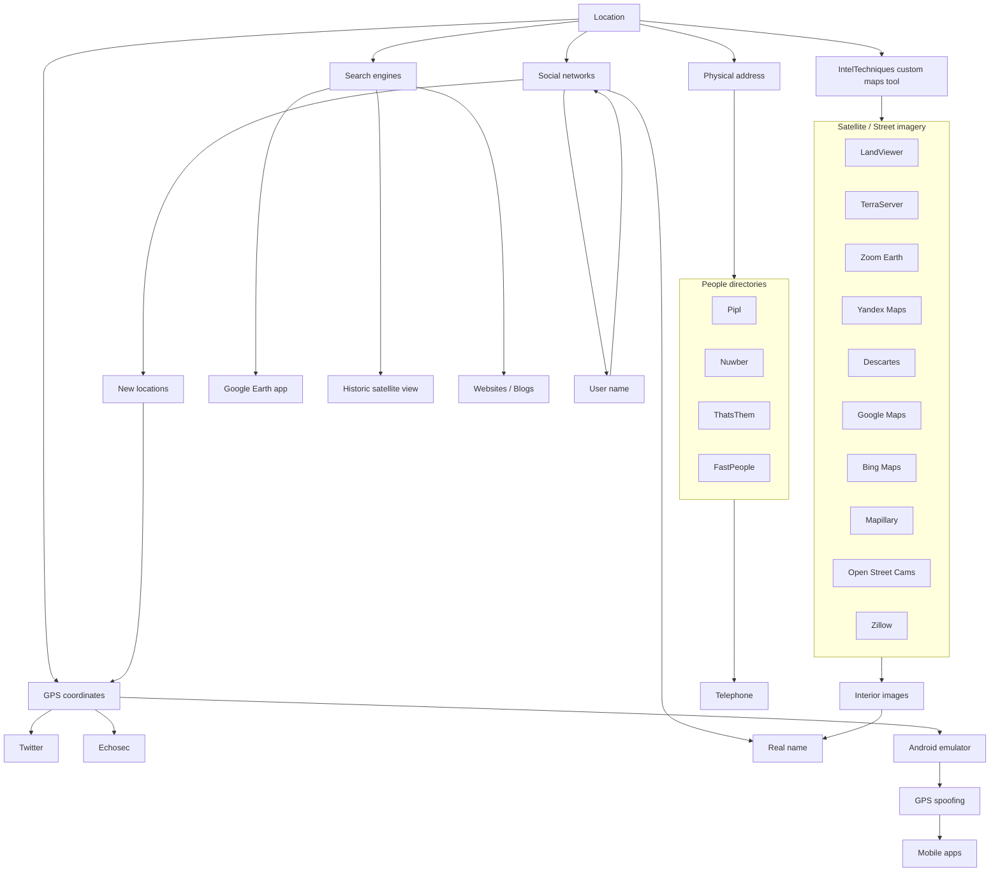
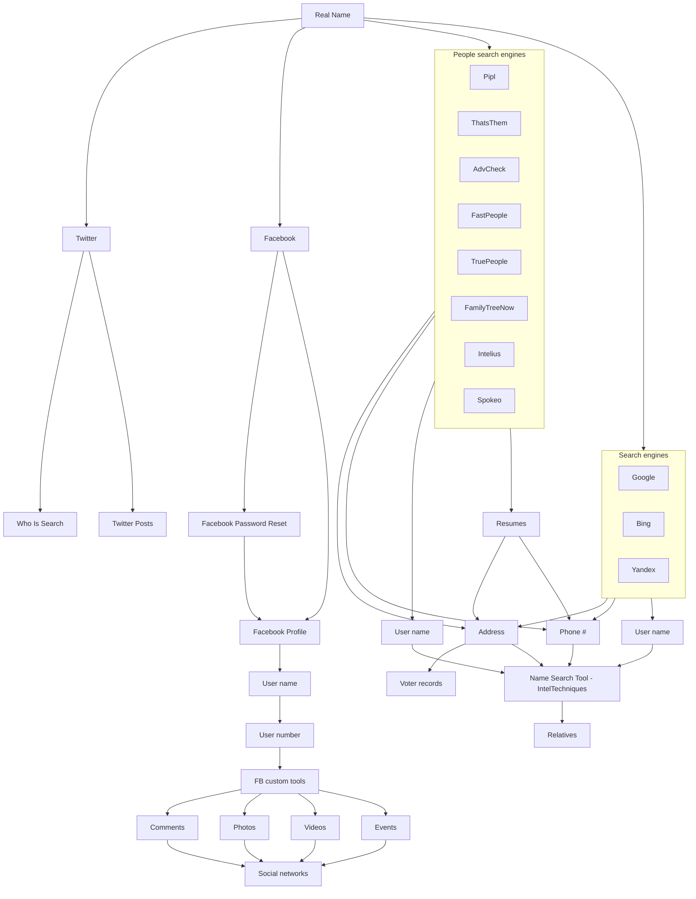
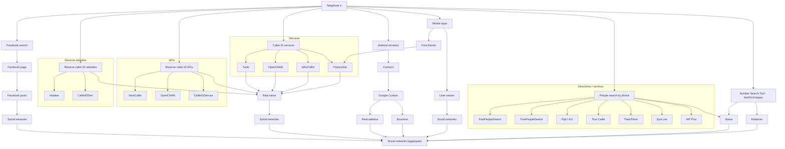

# OSINT Workflows (repo privado)

Guia visual de fluxos OSINT para **Google Dorks, Domínio, E-mail, Localização, Nome Real, Telefone e Username**.
Cada diagrama foi otimizado para leitura no GitHub (vertical e compacto).

> **✨ Novo**: Adicionado fluxo completo para **Google Dorks** com 7 categorias de busca e workflow de disclosure responsável.

## Índice
- [Fluxo: Google Dorks](#fluxo-google-dorks) ⭐ **NOVO!**
- [Fluxo: Domain Name](#fluxo-domain-name)
- [Fluxo: Email Address](#fluxo-email-address)
- [Fluxo: Location](#fluxo-location)
- [Fluxo: Real Name](#fluxo-real-name)
- [Fluxo: Telephone](#fluxo-telephone)
- [Fluxo: Username](#fluxo-username)
- [🧅 Recursos Dark Web/Onion](#recursos-dark-webonion) ⭐ **NOVO!**

---

## Fluxo: Google Dorks
[🔝 voltar ao índice](#índice)



**📖 Guia de Uso do Fluxo:**

1. **🛡️ Preparação OPSEC**: Sempre configure ambiente seguro antes de iniciar
2. **🎯 Definição de Escopo**: Use `site:target.com` para manter foco
3. **📂 Execução Sistemática**: Percorra cada categoria metodicamente
4. **🔍 Validação**: Confirme exposições antes de relatar
5. **⚖️ Disclosure Ético**: Reporte vulnerabilidades responsavelmente

**🚨 Lembretes Importantes:**
- ✅ Sempre obtenha autorização por escrito
- ✅ Mantenha logs de atividades
- ✅ Censure dados sensíveis em evidências
- ❌ Nunca acesse sistemas sem permissão
- ❌ Não baixe dados pessoais/confidenciais

**📚 Referência Completa**: [Google Dorks - Guia Completo](google-dorks-guia-completo.md)

---

## Fluxo: Domain Name
[🔝 voltar ao índice](#índice)



```mermaid
flowchart TB
    A["Domain Name"]

    %% Live website & engines
    subgraph S1 ["Live Website & Engines"]
      B["Live Website"]
      I["Google"]
      J["Bing"]
      K["Yandex"]
      L["Wayback Machine"]
      M["Cached"]
      N["site: Search"]
      O["IntelTechniques Domain Search Tool"]
    end

    %% Analytics
    subgraph S2 ["Analytics"]
      C1["SpyOnWeb"]
      C2["DomainCrawler"]
      C3["AnalyzeID"]
      C4["NerdyData"]
      C5["PubDB"]
    end

    %% Domain/Whois/History
    subgraph S3 ["Domain / WHOIS / History"]
      U["Domain History"]
      V["Whoisology"]
      W["Who.is"]
      X["WhoisInfo"]
      Y["ViewDNS Whois"]
      Z["WhoisMind"]
      AA["Who.is History"]
      AB["DNSTrails"]
      AC["ViewDNS-IP"]
      AD["ViewDNSHistory"]
      AE["Backlinks"]
      AF["SharedCount"]
      AG["Robots.txt"]
      AH["Hidden Pages"]
    end

    %% FOCA
    subgraph S4 ["FOCA Extraction"]
      P["Real Name"]
      Q["Email Address"]
      R["Documents"]
      S["IP Address"]
      T["Social Networks"]
    end

    %% Infra & Pentest
    subgraph S5 ["Infra & Pentest"]
      D["New Domains"]
      E["Pentest Tools"]
      F["Sub Domains"]
      H["App: Metagoofil"]
    end

    A --> B
    A --> C1
    A --> P
    A --> D

    B --> I
    B --> J
    B --> K
    B --> L
    I --> M
    J --> M
    K --> M
    L --> M
    M --> N
    N --> O
    O --> U
    O --> V
    O --> W
    O --> X
    O --> Y
    O --> Z
    O --> AA
    O --> AB
    O --> AC
    O --> AD
    O --> AE
    O --> AF
    O --> AG
    O --> AH

    C5 --> P
    E --> F
    F --> H
    T --> AI["Small SEO Tools"]

    %% Integração com Google Dorks
    A --> GD["🔍 Google Dorks"]
    GD --> GD1["site:domain.com ext:conf"]
    GD --> GD2["site:domain.com inurl:admin"]
    GD --> GD3["site:domain.com ext:bak"]
    GD1 --> U
    GD2 --> E
    GD3 --> AB
```

**💡 Dica**: Para uma investigação mais completa do domínio, use também o [Fluxo: Google Dorks](#fluxo-google-dorks) com foco específico no `site:dominio.com`.

---

## Fluxo: Email Address
[🔝 voltar ao índice](#índice)



---

## Fluxo: Location
[🔝 voltar ao índice](#índice)



---

## Fluxo: Real Name
[🔝 voltar ao índice](#índice)



---

## Fluxo: Telephone
[🔝 voltar ao índice](#índice)



---

## Fluxo: Username
[🔝 voltar ao índice](#índice)

```mermaid
flowchart TB
    A["User name"]

    subgraph SE ["Search engines"]
      G["Google"]
      B["Bing"]
      Y["Yandex"]
    end
    A --> SE

    subgraph UST ["Username search tools"]
      K["Knowem"]
      CU["CheckUsernames"]
      NV["NameVine"]
      USH["UserSherlock"]
      USE["UserSearch"]
      PY["PeekYou"]
      PIPL["Pipl"]
    end
    A --> UST

    A --> PEA["Potential email addresses"]
    subgraph DOMS ["Common email domains"]
      D1["x@gmail.com"]
      D2["x@yahoo.com"]
      D3["x@outlook.com"]
      D4["x@live.com"]
      D5["x@hushmail.com"]
      D6["x@mail.com"]
      D7["x@facebook.com"]
    end
    PEA --> DOMS
    DOMS --> EADDR["Email address"]

    A --> ASSU["Email assumptions"]
    ASSU --> HIBP["Have I Been Pwned"]
    ASSU --> HE["Hacked-Emails"]
    HIBP --> EADDR
    HE --> EADDR

    subgraph API ["API searches"]
      AP1["Pipl"]
      AP2["HIBP"]
      AP3["Hacked-Emails"]
      AP4["FullContact"]
    end
    EADDR --> API

    subgraph MAN ["Manual attempts"]
      TW["Twitter"]
      IG["Instagram"]
      FB["Facebook"]
      YT["YouTube"]
    end
    A --> MAN

    IA["Internet archives"]
    SE --> IA

    SN["Social networks"]
    SE --> SN
    UST --> SN
    API --> SN
    MAN --> SN
    IA --> SN

---

## Recursos Dark Web/Onion
[🔝 voltar ao índice](#índice)

### 🧅 Fluxo de Investigação na Dark Web

```mermaid
flowchart TB
    A["🎯 Alvo/POI Identificado"]

    %% Preparação OPSEC
    subgraph S1 ["🛡️ Preparação OPSEC Avançada"]
        B1["VPN Multi-Hop + Tor"]
        B2["VM Isolada (Tails/Whonix)"]
        B3["Autorização Legal Obtida"]
        B4["Sock Puppet Preparado"]
        B5["Documentação Segura"]
    end

    %% Catálogos e Diretórios
    subgraph S2 ["🗂️ Catálogos e Diretórios"]
        C1["Hidden Wiki"]
        C2["Just Onion"]
        C3["Top Onions"]
        C4["Onion Dir"]
        C5["CheckItOnion"]
        C6["Tor Yellow Pages"]
    end

    %% Motores de Busca Dark Web
    subgraph S3 ["🔍 Motores de Busca Especializados"]
        D1["Ahmia.fi"]
        D2["Torch"]
        D3["Haystak"]
        D4["DarkSearch"]
        D5["OnionSearch Tool"]
        D6["Katana"]
    end

    %% Análise por Tipo de Conteúdo
    subgraph S4 ["📊 Análise por Categoria"]
        E1["Fóruns por Região 🌍"]
        E2["Chats Anônimos 💬"]
        E3["Pastebins 📋"]
        E4["Imageboards 📸"]
        E5["Marketplaces 🛒"]
        E6["Mídia/News 📰"]
    end

    %% Fóruns Regionais
    subgraph S5 ["🇷🇺🇫🇷🇩🇪🇹🇷🇧🇷 Fóruns Regionais"]
        F1["Verified Forum (RU)"]
        F2["French World (FR)"]
        F3["Germania (DE)"]
        F4["Shadow Forum (TR)"]
        F5["Respostas Ocultas (BR)"]
        F6["Dread (Global)"]
    end

    %% Ferramentas de Análise
    subgraph S6 ["🔧 Ferramentas de Análise"]
        G1["OnionScan"]
        G2["TorBot"]
        G3["VigilantOnion"]
        G4["Onioff"]
        G5["DeepDarkCTI"]
        G6["Darksearch Tools"]
    end

    %% Coleta e Análise
    subgraph S7 ["📝 Coleta e Documentação"]
        H1["Screenshots Censurados"]
        H2["Metadados de Links"]
        H3["Análise de Disponibilidade"]
        H4["Mapping de Comunidades"]
        H5["Timeline de Atividades"]
    end

    %% Threat Intelligence
    subgraph S8 ["🚨 Threat Intelligence"]
        I1["IOCs Extraction"]
        I2["TTPs Mapping"]
        I3["Ransomware Groups"]
        I4["Threat Actor Attribution"]
        I5["CVE/Exploit Tracking"]
    end

    %% Fluxo Principal
    A --> B1
    A --> B2
    A --> B3
    A --> B4
    A --> B5

    B1 --> C1
    B2 --> D1
    B3 --> E1
    B4 --> F1
    B5 --> G1

    %% Conexões entre catálogos e busca
    C1 --> C2
    C2 --> C3
    C3 --> C4
    C4 --> C5
    C5 --> C6

    C6 --> D1
    D1 --> D2
    D2 --> D3
    D3 --> D4
    D4 --> D5
    D5 --> D6

    %% Análise de conteúdo
    D6 --> E1
    E1 --> E2
    E2 --> E3
    E3 --> E4
    E4 --> E5
    E5 --> E6

    %% Fóruns específicos
    E1 --> F1
    E1 --> F2
    E1 --> F3
    E1 --> F4
    E1 --> F5
    E1 --> F6

    %% Análise técnica
    F6 --> G1
    G1 --> G2
    G2 --> G3
    G3 --> G4
    G4 --> G5
    G5 --> G6

    %% Documentação
    G6 --> H1
    H1 --> H2
    H2 --> H3
    H3 --> H4
    H4 --> H5

    %% Threat Intelligence
    H5 --> I1
    I1 --> I2
    I2 --> I3
    I3 --> I4
    I4 --> I5

    %% Especialização por tipo
    E2 --> CHATS["Chats Anônimos"]
    CHATS --> CHAT1["BlackHat Chat"]
    CHATS --> CHAT2["WSS.chat"]
    CHATS --> CHAT3["Abyss"]

    E3 --> PASTE["Pastebins"]
    PASTE --> PASTE1["V3 Paste"]
    PASTE --> PASTE2["Stronghold"]

    E5 --> TI["🚨 Monitoramento TI"]
    TI --> TI1["Ransomware Groups"]
    TI --> TI2["Breach Forums"]
    TI --> TI3["Carding Forums"]
```

**📖 Guia de Uso do Fluxo Dark Web:**

1. **🛡️ OPSEC Crítico**: Configure ambiente ultra-seguro (Tails/Whonix + VPN)
2. **🎭 Sock Puppets**: Use personas fictícias criadas especificamente para investigação
3. **🔍 Busca Sistemática**: Percorra catálogos → motores → fóruns específicos
4. **📊 Categorização**: Organize achados por tipo (fóruns, chats, pastebins, etc.)
5. **🇺🇳 Análise Regional**: Explore fóruns regionais baseados no alvo
6. **🔧 Ferramentas Automatizadas**: Use OnionScan, TorBot para análise técnica
7. **📝 Documentação Segura**: Capture evidências censuradas e metadados
8. **🚨 Threat Intelligence**: Extraia IOCs, TTPs para análise de ameaças

**🚨 Alertas Críticos de Segurança:**
- ✅ **SEMPRE** use Tails ou Whonix para acesso
- ✅ **SEMPRE** configure VPN antes do Tor
- ✅ **NUNCA** baixe arquivos executáveis
- ✅ **NUNCA** use credenciais reais
- ✅ **SEMPRE** documente com timestamps e fontes
- ❌ **NUNCA** acesse sem autorização legal formal
- ❌ **NUNCA** participe em atividades ilícitas

**📚 Recursos Detalhados**:
- [Diretório Completo de Recursos Onion](diretorio-recursos-onion.md)
- [Guia OSINT Dark Web](../osint_darkweb_doc.md)
- [Checklist OPSEC](../../checklists/checklist-opsec.md)
```
