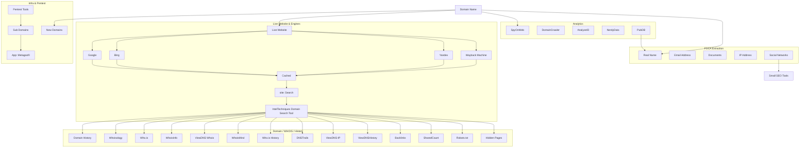
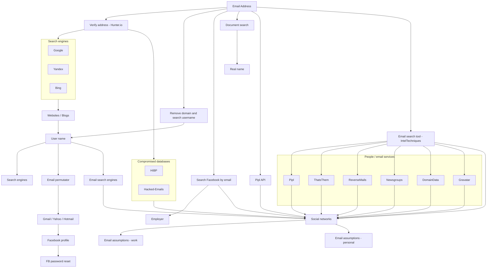
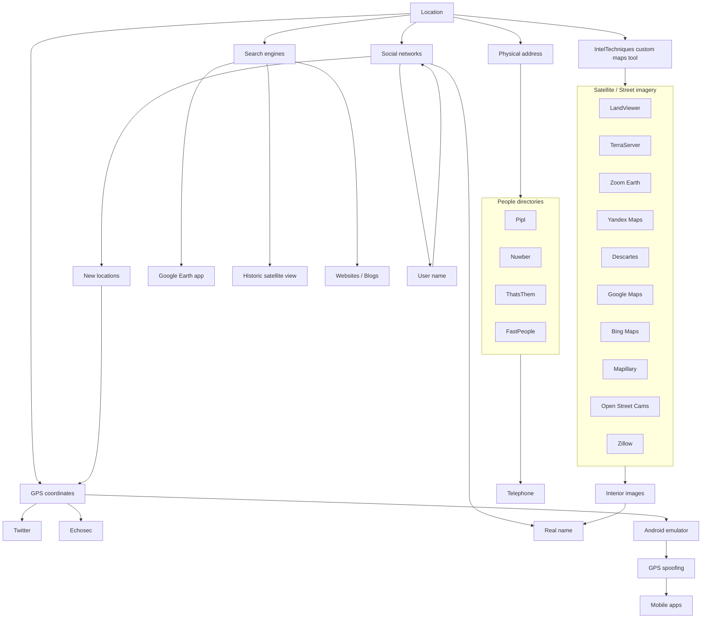
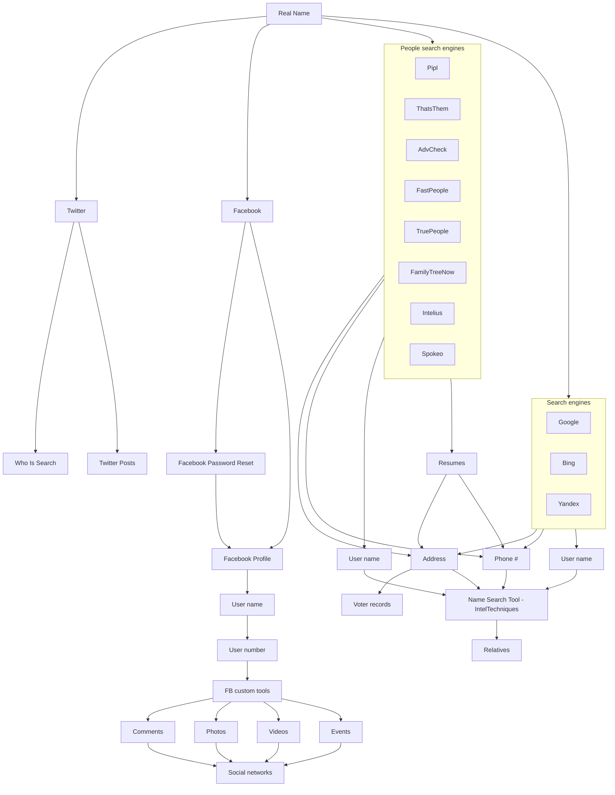
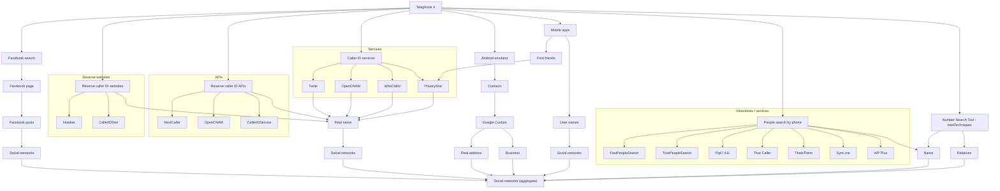
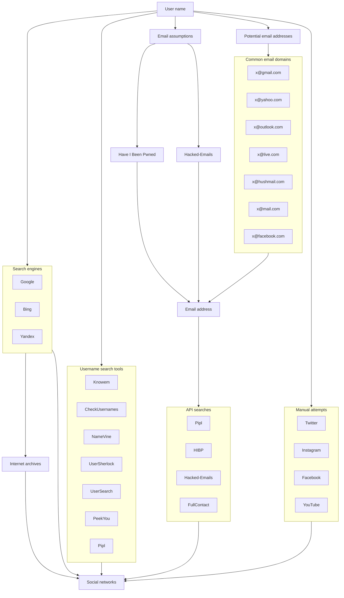

# OSINT Workflows (repo privado)

Guia visual de fluxos OSINT para **Domínio, E-mail, Localização, Nome Real, Telefone e Username**.  
Cada diagrama foi otimizado para leitura no GitHub (vertical e compacto).

## Índice
- [Fluxo: Domain Name](#fluxo-domain-name)
- [Fluxo: Email Address](#fluxo-email-address)
- [Fluxo: Location](#fluxo-location)
- [Fluxo: Real Name](#fluxo-real-name)
- [Fluxo: Telephone](#fluxo-telephone)
- [Fluxo: Username](#fluxo-username)

---

## Fluxo: Domain Name
[🔝 voltar ao índice](#índice)

---

## Fluxo: Email Address
[🔝 voltar ao índice](#índice)

---

## Fluxo: Location
[🔝 voltar ao índice](#índice)

---

## Fluxo: Real Name
[🔝 voltar ao índice](#índice)

---

## Fluxo: Telephone
[🔝 voltar ao índice](#índice)

---

## Fluxo: Username
[🔝 voltar ao índice](#índice)

