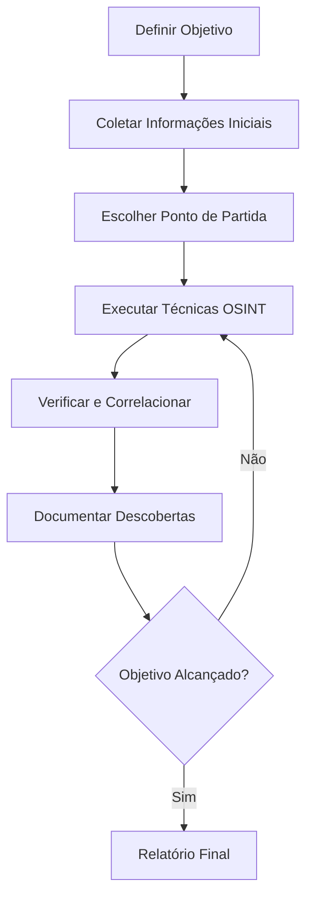

# OSINT para Iniciantes — Guia Completo do Zero ao Avançado

## 🎯 O que é OSINT?

**Open Source Intelligence (OSINT)** é a prática de coletar, analisar e interpretar informações de fontes públicas para responder perguntas específicas ou resolver problemas investigativos.

### Para que serve OSINT?
- 🔒 **Cibersegurança**: Identificar ameaças, vulnerabilidades e indicadores de comprometimento
- 👮 **Investigações**: Localizar pessoas, validar informações, mapear conexões
- 🏢 **Due Diligence**: Pesquisar empresas, parceiros e fornecedores
- 📰 **Jornalismo**: Verificar fatos, encontrar fontes, validar informações
- 🌍 **Pesquisa Acadêmica**: Coletar dados públicos para estudos

---

## 🚀 Começando sua Jornada OSINT

### Pré-requisitos
- ✅ Computador com acesso à internet
- ✅ Curiosidade e pensamento crítico
- ✅ Compromisso com ética e legalidade
- ✅ Paciência para documentar e verificar informações

### Primeiros Conceitos
1. **Fontes Abertas**: Informações disponíveis publicamente
2. **Verificação**: Confirmar dados com múltiplas fontes
3. **OPSEC**: Segurança operacional para proteger investigações
4. **Pivoting**: Usar uma informação para encontrar outras

---

## 🎓 Módulo 1: Configuração Segura

### 1.1 Ambiente de Investigação
```bash
# Configuração básica recomendada
- VPN confiável (NordVPN, ExpressVPN)
- Navegador dedicado (Firefox com extensões)
- VM isolada (VirtualBox/VMware)
- Gerenciador de senhas (Bitwarden, KeePass)
```

### 1.2 Extensões Essenciais para Navegador
- **Wayback Machine** — acesso rápido ao Archive.org
- **Wappalyzer** — identifica tecnologias de websites
- **User-Agent Switcher** — muda identificação do navegador
- **uBlock Origin** — bloqueia rastreadores
- **ClearURLs** — remove parâmetros de rastreamento

### 1.3 Criando seu Primeiro Sock Puppet
Um sock puppet é uma persona digital criada para investigações.

**Elementos básicos:**
- Email dedicado (ProtonMail recomendado)
- Nome fictício mas convincente
- Foto de perfil (gerada por IA)
- História coerente e simples
- Documentação de todos os detalhes

📋 **Use nosso:** [Checklist de Criação de Sock Puppet](../../checklists/checklist-criacao-sock-puppet.md)

---

## 🔍 Módulo 2: Primeiras Investigações

### 2.1 Investigação Básica por Nome
**Objetivo**: Encontrar informações sobre "João Silva"

**Passo a passo:**
1. **Google básico**: `"João Silva"` (com aspas)
2. **Imagens**: buscar fotos relacionadas
3. **Redes sociais**: Facebook, LinkedIn, Instagram
4. **Registros públicos**: cartórios, empresas

**Ferramentas essenciais:**
- Google Advanced Search
- TinEye (busca reversa de imagens)
- Sherlock (usernames em múltiplas plataformas)

### 2.2 Investigação por Domínio
**Objetivo**: Mapear "exemplo.com.br"

**Passo a passo:**
1. **WHOIS**: `whois exemplo.com.br`
2. **Subdomínios**: usar Sublist3r ou Amass
3. **Tecnologias**: Wappalyzer, BuiltWith
4. **Histórico**: Wayback Machine

**Comandos úteis:**
```bash
# WHOIS básico
whois exemplo.com.br

# DNS records
nslookup exemplo.com.br
dig exemplo.com.br ANY

# Subdomínios com Sublist3r
sublist3r -d exemplo.com.br
```

### 2.3 Investigação por Email
**Objetivo**: Validar "contato@empresa.com"

**Passo a passo:**
1. **Verificar existência**: Hunter.io, EmailHippo
2. **Vazamentos**: HaveIBeenPwned, DeHashed
3. **Redes sociais**: Holehe, registrations
4. **Domínio**: análise do domínio do email

---

## 🛠️ Módulo 3: Ferramentas Fundamentais

### 3.1 Kit de Ferramentas Gratuitas

#### Busca e Verificação
- **Google Dorks** — operadores avançados de busca
- **Sherlock** — usernames em 350+ sites
- **WhatsMyName** — verificação rápida de usuários
- **TinEye** — busca reversa de imagens
- **Yandex Images** — excelente para reconhecimento facial

#### Domínios e IPs
- **WHOIS** — informações de registro
- **Shodan** — busca por dispositivos conectados
- **Censys** — mapeamento de infraestrutura
- **URLVoid** — verificação de reputação
- **VirusTotal** — análise de URLs e arquivos

#### Redes Sociais
- **Social Searcher** — busca em múltiplas redes
- **TweetDeck** — monitoramento do Twitter
- **Pipl** — agregador de perfis públicos
- **PeekYou** — busca por pessoas

### 3.2 Comandos Google Dorks Essenciais
```
# Arquivos específicos em site
site:empresa.com filetype:pdf

# Informações sensíveis
intext:"usuário" intext:"senha" site:empresa.com

# Páginas de login
intitle:"login" site:empresa.com

# Documentos vazados
"confidencial" filetype:doc site:empresa.com

# Informações de contato
"@empresa.com" -site:empresa.com
```

---

## 📋 Módulo 4: Metodologia e Documentação

### 4.1 Processo Investigativo Estruturado



### 4.2 Template de Documentação
Para cada informação coletada, registre:

| Campo | Exemplo | Obrigatório |
|-------|---------|-------------|
| **Valor** | João Silva | ✅ |
| **Fonte** | Facebook.com | ✅ |
| **URL** | facebook.com/joao.silva | ✅ |
| **Data/Hora** | 2024-01-15 14:30 | ✅ |
| **Confiança** | 🟢 Alta / 🟡 Média / 🔴 Baixa | ✅ |
| **Método** | Busca manual | ❌ |
| **Observações** | Perfil público, última atividade recente | ❌ |

### 4.3 Níveis de Confiança
- 🟢 **Alta**: Múltiplas fontes independentes confirmam
- 🟡 **Média**: Fonte única confiável ou duas fontes correlacionadas
- 🔴 **Baixa**: Fonte única não verificada ou dados contraditórios

---

## ⚡ Módulo 5: Casos Práticos

### 5.1 Caso 1: Pessoa Desaparecida
**Cenário**: Localizar João Silva, 35 anos, desaparecido há 3 dias

**Informações iniciais:**
- Nome: João Silva
- Idade: 35 anos
- Última localização: São Paulo, SP
- Telefone: (11) 99999-9999

**Processo:**
1. **Redes sociais**: Buscar perfis com nome/idade
2. **Telefone**: Validar operadora e região
3. **Geolocalização**: Mapear última localização conhecida
4. **Conexões**: Família, amigos, trabalho
5. **Histórico digital**: Posts recentes, check-ins

### 5.2 Caso 2: Verificação de Empresa
**Cenário**: Due diligence da "TechSolutions LTDA"

**Processo:**
1. **CNPJ**: Receita Federal, Jucesp
2. **Domínios**: WHOIS, tecnologias utilizadas
3. **Executivos**: LinkedIn, Lattes, notícias
4. **Reputação**: Reclame Aqui, processos judiciais
5. **Concorrência**: Empresas similares, mercado

### 5.3 Caso 3: Phishing Analysis
**Cenário**: Analisar email suspeito de phishing

**Processo:**
1. **Headers**: Analisar origem real do email
2. **Links**: Expandir URLs encurtadas
3. **Domínio**: WHOIS, reputação, idade
4. **Infraestrutura**: Shodan, Censys
5. **IOCs**: Indicadores de comprometimento

---

## 🎯 Módulo 6: Especializações

### 6.1 OSINT para Cibersegurança
- Threat intelligence
- Monitoramento de vazamentos
- Análise de malware
- Mapeamento de superfície de ataque

### 6.2 OSINT para Jornalismo
- Verificação de fatos
- Investigação de fontes
- Análise de mídias sociais
- Geolocalização de eventos

### 6.3 OSINT Corporativo
- Due diligence
- Monitoramento de marca
- Intelligence competitiva
- Compliance e auditoria

---

## ⚠️ Considerações Éticas e Legais

### Sempre Respeite:
- ✅ **Leis locais** e jurisdições aplicáveis
- ✅ **Termos de Serviço** das plataformas
- ✅ **Privacidade** das pessoas envolvidas
- ✅ **Propósito legítimo** da investigação

### Nunca Faça:
- ❌ Hacking ou acesso não autorizado
- ❌ Assédio ou stalking
- ❌ Uso malicioso de informações
- ❌ Violação de privacidade

---

## 🎓 Próximos Passos

### Depois deste tutorial:
1. **Pratique** com casos reais (sempre éticos)
2. **Especialize-se** em uma área específica
3. **Participe** de comunidades OSINT
4. **Continue aprendendo** com cursos avançados

### Recursos para Continuar:
- [Trilha de Aprendizado Progressiva](trilha-progressiva-osint.md)
- [Workflows Visuais](../Processos/Investigativos/workflows.md)
- [Guias Especializados](../Processos/Investigativos/)
- [Checklists de OPSEC](../../checklists/checklist-opsec.md)

---

## 🔗 Links Úteis

### Comunidades
- r/OSINT (Reddit)
- OSINT Framework
- Bellingcat Discord
- Intelligence-X Community

### Cursos Online
- SANS FOR578 (pago)
- Bellingcat Toolkit (gratuito)
- OSINT Curious (gratuito)
- Udemy OSINT Courses (variados)

### Certificações
- GOSI (GIAC Open Source Intelligence)
- IICRC OSINT
- EC-Council CTIA

---

**🎉 Parabéns!** Você completou o tutorial básico de OSINT. Continue praticando e sempre mantendo os princípios éticos em mente.