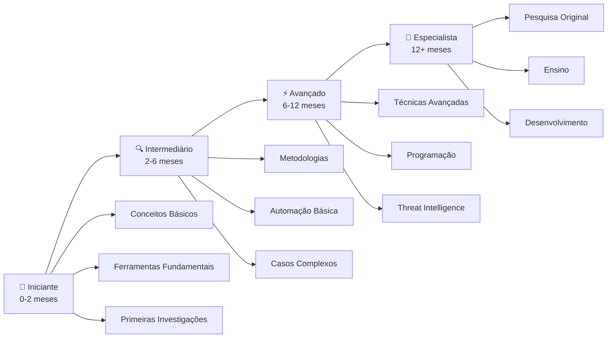

# Trilha de Aprendizado Progressiva OSINT

## 🎯 Visão Geral

Esta trilha foi desenvolvida para levar você do nível iniciante ao avançado em OSINT de forma estruturada e prática. Cada fase inclui teoria, prática e projetos reais.

---

## 📈 Estrutura da Trilha

---

## 🌱 Fase 1: Iniciante (0-2 meses)

### Objetivos
- Compreender conceitos fundamentais de OSINT
- Configurar ambiente seguro de investigação
- Realizar primeiras investigações simples
- Desenvolver pensamento investigativo

### 📚 Conhecimentos Essenciais

#### Semana 1-2: Fundamentos
- [ ] **Conceitos**: O que é OSINT, ética, legalidade
- [ ] **Configuração**: VPN, navegador, extensões
- [ ] **OPSEC básico**: Sock puppets, anonimização
- [ ] **Documentação**: Templates, níveis de confiança

📖 **Leitura obrigatória**: [OSINT para Iniciantes](osint-para-iniciantes.md)

#### Semana 3-4: Ferramentas Básicas
- [ ] **Google**: Operadores avançados, dorks
- [ ] **Busca de imagens**: TinEye, Yandex, Google Images
- [ ] **Redes sociais**: Facebook, LinkedIn, Instagram
- [ ] **Verificação básica**: Have I Been Pwned, Hunter.io

#### Semana 5-6: Primeiras Investigações
- [ ] **Por nome**: Pessoa física simples
- [ ] **Por email**: Validação e correlação
- [ ] **Por username**: Múltiplas plataformas
- [ ] **Por telefone**: Operadora e região

#### Semana 7-8: Prática e Consolidação
- [ ] **Projeto 1**: Investigar pessoa pública (político, jornalista)
- [ ] **Projeto 2**: Mapear empresa pequena
- [ ] **Projeto 3**: Verificar notícia ou rumor
- [ ] **Documentação**: Relatório com template padrão

### 🎯 Marco Iniciante
**Critério de aprovação**: Completar investigação de pessoa pública com pelo menos 10 informações verificadas de 3 fontes diferentes.

---

## 🔍 Fase 2: Intermediário (2-6 meses)

### Objetivos
- Dominar metodologias estruturadas
- Usar ferramentas automatizadas
- Realizar investigações complexas
- Especializar-se em área específica

### 📚 Conhecimentos Intermediários

#### Mês 1: Metodologias Avançadas
- [ ] **Intelligence Cycle**: Planejamento, coleta, análise, disseminação
- [ ] **Hypothesis-driven**: Investigação baseada em hipóteses
- [ ] **Link analysis**: Mapeamento de relacionamentos
- [ ] **Timeline analysis**: Análise temporal de eventos

#### Mês 2: Automação e Eficiência
- [ ] **Maltego**: Visualização de relacionamentos
- [ ] **Sherlock/Maigret**: Busca automatizada de usernames
- [ ] **Recon-ng**: Framework de reconhecimento
- [ ] **Scripts básicos**: Python para automação

#### Mês 3: Investigação de Infraestrutura
- [ ] **WHOIS avançado**: Histórico, correlações
- [ ] **Shodan/Censys**: Dispositivos e serviços expostos
- [ ] **Certificate Transparency**: Logs de certificados
- [ ] **BGP/ASN**: Roteamento e propriedade de IPs

#### Mês 4: Especialização (escolha uma área)

**Opção A: Cibersegurança**
- [ ] **Threat intelligence**: IOCs, TTPs, atribuição
- [ ] **Malware analysis**: Hashes, families, C2s
- [ ] **Dark web**: Marketplaces, forums, leaks
- [ ] **Incident response**: OSINT para resposta

**Opção B: Investigação Pessoal**
- [ ] **Social engineering**: Técnicas de elicitação
- [ ] **Geolocalização**: EXIF, landmarks, mapas
- [ ] **Vehicle OSINT**: Placas, modelos, tracking
- [ ] **Financial OSINT**: Empresas, patrimônio, transações

**Opção C: Mídia e Verificação**
- [ ] **Reverse image search**: Avançado
- [ ] **Video analysis**: Metadados, geolocalização
- [ ] **Deepfake detection**: Ferramentas e técnicas
- [ ] **Social media forensics**: Posts deletados, archived

### 🎯 Projetos Intermediários
1. **Mapeamento Corporativo**: Investigar empresa de médio porte
2. **Análise de Ameaça**: Investigar grupo APT conhecido
3. **Verificação de Evento**: Validar acontecimento recente
4. **Análise de Persona**: Perfil completo de influenciador

### 🎯 Marco Intermediário
**Critério de aprovação**: Completar análise de threat actor com mapeamento de infraestrutura e TTPs.

---

## ⚡ Fase 3: Avançado (6-12 meses)

### Objetivos
- Desenvolver técnicas próprias
- Programar ferramentas customizadas
- Liderar investigações complexas
- Contribuir para comunidade

### 📚 Conhecimentos Avançados

#### Mês 1-2: Programação para OSINT
- [ ] **Python avançado**: APIs, scraping, análise
- [ ] **Frameworks**: Scrapy, Selenium, BeautifulSoup
- [ ] **Databases**: Armazenamento e correlação de dados
- [ ] **Visualização**: NetworkX, Gephi, D3.js

#### Mês 3-4: Técnicas Avançadas
- [ ] **OSINT em blockchain**: Bitcoin, Ethereum analysis
- [ ] **IoT OSINT**: Câmeras, sensores, smart devices
- [ ] **Satellite imagery**: Análise temporal e espacial
- [ ] **Radio frequency**: SDR, signal analysis

#### Mês 5-6: Investigações Complexas
- [ ] **Multi-domain investigations**: Correlação entre múltiplas áreas
- [ ] **Time-sensitive**: Investigações em tempo real
- [ ] **Adversarial**: Contra-investigação e anti-OSINT
- [ ] **Cross-border**: Investigações internacionais

### 🎯 Projetos Avançados
1. **Ferramenta Original**: Desenvolver e publicar ferramenta OSINT
2. **Investigação Jornalística**: Colaborar com veículo de mídia
3. **CTF/Challenge**: Criar desafio para comunidade
4. **Paper/Research**: Publicar pesquisa original

### 🎯 Marco Avançado
**Critério de aprovação**: Publicar ferramenta OSINT no GitHub com 50+ stars ou paper aceito em conferência.

---

## 🎯 Fase 4: Especialista (12+ meses)

### Objetivos
- Inovar na área de OSINT
- Ensinar e mentorar outros
- Influenciar práticas da indústria
- Pesquisar novas fronteiras

### 📚 Atividades de Especialista

#### Pesquisa e Desenvolvimento
- [ ] **Novas metodologias**: Criar frameworks inovadores
- [ ] **AI/ML aplicado**: Machine learning para OSINT
- [ ] **Privacy engineering**: Técnicas de preservação
- [ ] **Academic research**: Publicações científicas

#### Liderança e Ensino
- [ ] **Mentorias**: Orientar investigadores junior
- [ ] **Workshops**: Ministrar treinamentos
- [ ] **Comunidade**: Liderar grupos e projetos
- [ ] **Standards**: Contribuir para padrões da indústria

#### Impacto Prático
- [ ] **Consultoria**: Assessorar organizações
- [ ] **Incident response**: Liderar investigações críticas
- [ ] **Policy**: Influenciar políticas públicas
- [ ] **Tools**: Desenvolver ferramentas comerciais

---

## 📊 Sistema de Avaliação

### Níveis de Competência

#### 🌱 Iniciante
- **Conhecimento**: Compreende conceitos básicos
- **Habilidades**: Usa ferramentas simples efetivamente
- **Investigações**: Casos simples com supervisão
- **Tempo**: Investigações de 2-4 horas

#### 🔍 Intermediário
- **Conhecimento**: Domina metodologias estruturadas
- **Habilidades**: Automatiza tarefas rotineiras
- **Investigações**: Casos complexos independentes
- **Tempo**: Investigações de 1-2 dias

#### ⚡ Avançado
- **Conhecimento**: Inova em técnicas e ferramentas
- **Habilidades**: Desenvolve soluções customizadas
- **Investigações**: Lidera equipes investigativas
- **Tempo**: Projetos de semanas/meses

#### 🎯 Especialista
- **Conhecimento**: Autoridade reconhecida na área
- **Habilidades**: Cria padrões da indústria
- **Investigações**: Define estratégias organizacionais
- **Tempo**: Impacto de longo prazo

---

## 🛠️ Recursos por Fase

### Ferramentas Gratuitas Essenciais
**Iniciante**: Google, TinEye, Hunter.io, WHOIS
**Intermediário**: Maltego CE, Sherlock, Recon-ng, Shodan (free)
**Avançado**: Python, Scrapy, Selenium, APIs customizadas
**Especialista**: Desenvolvimento próprio, infraestrutura dedicada

### Cursos Recomendados
**Iniciante**: OSINT Curious, Bellingcat Toolkit
**Intermediário**: SANS FOR578, IntelTechniques
**Avançado**: Custom training, conferências especializadas
**Especialista**: Research collaborations, academic programs

### Certificações
**Intermediário**: GOSI (GIAC Open Source Intelligence)
**Avançado**: CTIA (Certified Threat Intelligence Analyst)
**Especialista**: PhD/Master em áreas relacionadas

---

## 📅 Cronograma Sugerido

### Dedicação Tempo Parcial (5-10h/semana)
- **Iniciante**: 3-4 meses
- **Intermediário**: 8-12 meses
- **Avançado**: 18-24 meses
- **Especialista**: 36+ meses

### Dedicação Tempo Integral (20-40h/semana)
- **Iniciante**: 1-2 meses
- **Intermediário**: 3-6 meses
- **Avançado**: 8-12 meses
- **Especialista**: 18+ meses

---

## 🤝 Comunidade e Suporte

### Grupos de Estudo
- Forme grupos locais de prática
- Participe de CTFs e challenges
- Colabore em projetos open source
- Mentore iniciantes quando possível

### Eventos e Conferências
- BSides locais
- DEFCON Villages
- OSINT Summit
- Academic conferences

### Recursos Contínuos
- Newsletter especializadas
- Podcasts de OSINT
- Blogs de pesquisadores
- GitHub repositories

---

## 🎯 Próximos Passos

1. **Avalie seu nível atual** usando os critérios acima
2. **Escolha sua fase** e comece pelos conhecimentos essenciais
3. **Defina metas** para cada mês/semana
4. **Pratique regularmente** com casos reais
5. **Documente seu progresso** e compartilhe aprendizados
6. **Conecte-se** com a comunidade OSINT

**Lembre-se**: OSINT é uma jornada, não um destino. Continue sempre aprendendo e adaptando-se às novas tecnologias e desafios!